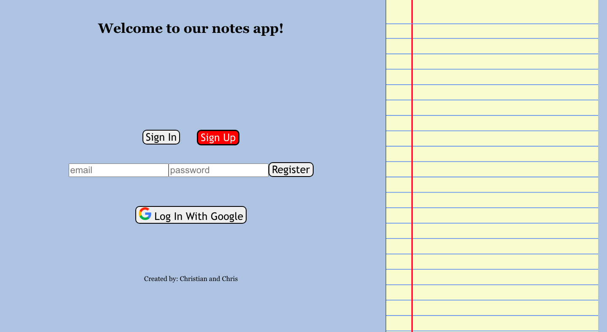
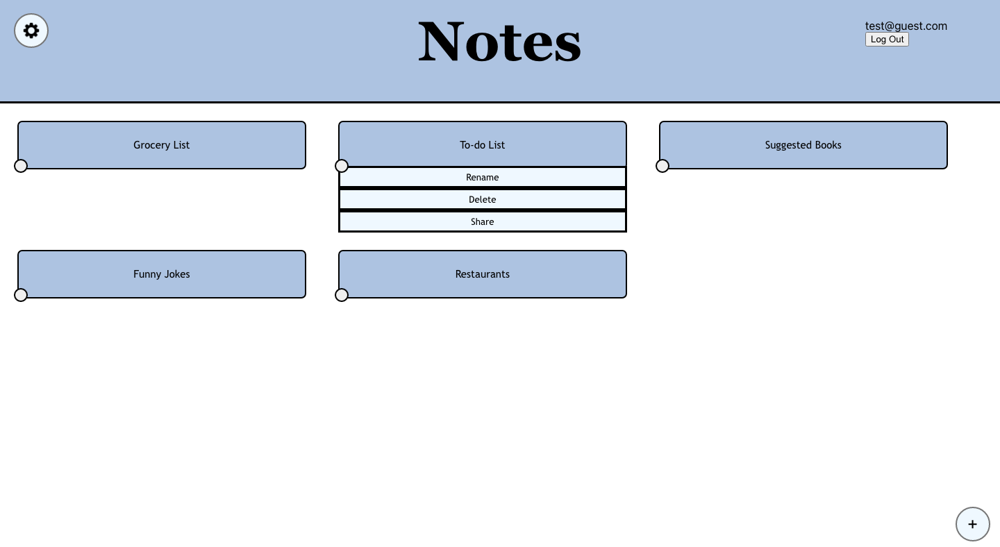
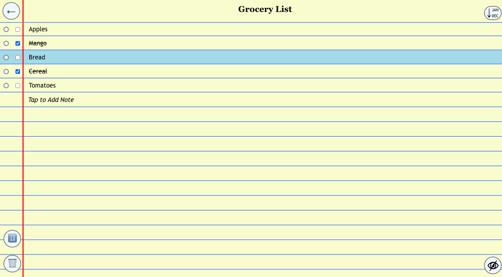

<a name="readme-top"></a>
[Link to running application](https://cs124-lab3-fe950--pr19-finalversion-b6pufl2v.web.app)


## INTRODUCTION

<!-- TABLE OF CONTENTS -->
<details>
  <summary>Table of Contents</summary>
  <ol>
    <li>
      <a href="#about-the-project">About The Project</a>
      <ul>
        <li><a href="#built-with">Built With</a></li>
      </ul>
    </li>
    <li>
      <a href="#getting-started">Getting Started</a>
      <ul>
        <li><a href="#prerequisites">Prerequisites</a></li>
        <li><a href="#installation">Installation</a></li>
      </ul>
    </li>
    <li><a href="#usage">Usage</a></li>
    <li><a href="#design">Design</a></li>
    <li><a href="#contact">Contact</a></li>
  </ol>
</details>


<!-- ABOUT THE PROJECT -->
## About The Project

[//]: # (Video of App)

This notes app allows you to create notes, keep them stored under your login details, and share with your friends. On 
each note, you can sort the items, hide checked off items, and prioritize or delete selected items.

<p align="right">(<a href="#readme-top">back to top</a>)</p>


### Built With
* [![Firebase][Firebase.com]][Firebase-url]
* [![Node][Node.js]][Node-url]
* [![React][React.js]][React-url]

<p align="right">(<a href="#readme-top">back to top</a>)</p>


<!-- GETTING STARTED -->
## Getting Started

### Prerequisites

* npm
  ```sh
  npm install npm@latest -g
  ```

### Installation

1. Clone the repo
   ```sh
   git clone https://github.com/cvaldovinos/cs124-lab2.git
   ```
2. Install NPM packages
   ```sh
   npm install
   ```
   
<p align="right">(<a href="#readme-top">back to top</a>)</p>


<!-- USAGE EXAMPLES -->
## Usage


On the login screen, you are greeted and presented the options of either logging in or signing in via an email and 
password or using Google authentication.


On the home page, you can add a note with the plus button in the bottom right, log out in the top right, or select the 
options for an individual note by clicking the button in the bottom left corner of each note.


On each note, you can add items by clicking on the "Tap to Add Note line". Then you can cross off each item with the 
checkbox. Once an item has been checked off, the eye icon in the bottom right corner appears allowing you to hide/reveal 
any crossed off items. Lastly, you can select lines and in the bottom right you can delete the selected items, or you 
can assign them a priority. This feature is useful for the button in the top right corner which allows you to sort
items either alphabetically, reverse alphabetically, oldest to newest, newest to oldest, or by priorities.

<p align="right">(<a href="#readme-top">back to top</a>)</p>

<!-- DESIGN -->
## Design

While creating this project, the design decisions have been tracked on this document: 
[Design.md](https://github.com/cvaldovinos/cs124-lab2/blob/finalVersion/design/design.md)

<p align="right">(<a href="#readme-top">back to top</a>)</p>


<!-- CONTACT -->
## Contact

Christian Valdovinos - cvaldovinos@hmc.edu

Chris Couto - ccouto@hmc.edu

[Link to running application](https://cs124-lab3-fe950--pr19-finalversion-b6pufl2v.web.app)

<p align="right">(<a href="#readme-top">back to top</a>)</p>


<!-- MARKDOWN LINKS & IMAGES -->
<!-- https://www.markdownguide.org/basic-syntax/#reference-style-links -->
[Firebase.com]: https://img.shields.io/badge/firebase-ffca28?style=for-the-badge&logo=firebase&logoColor=black
[Firebase-url]: https://firebase.google.com/
[Node.js]: https://img.shields.io/badge/Node.js-339933?style=for-the-badge&logo=nodedotjs&logoColor=white
[Node-url]: https://nodejs.org/
[React.js]: https://img.shields.io/badge/React-20232A?style=for-the-badge&logo=react&logoColor=61DAFB
[React-url]: https://reactjs.org/
