### [Link to Design Document for Lab 1](designlab1.md)

# Final Design Walkthrough

Here is the starting page for our list app! The back button is purely decorative and the list title cannot be changed,
but we figured that those would make more sense to tackle during Lab 4 when we'll be implementing
a system for multiple lists at once.

When you tap the 'Tap to Add Note' line, it snaps to a blank text box which you can fill in with a note. You can either 
click off the text box or hit 'Enter' to finalize the line.

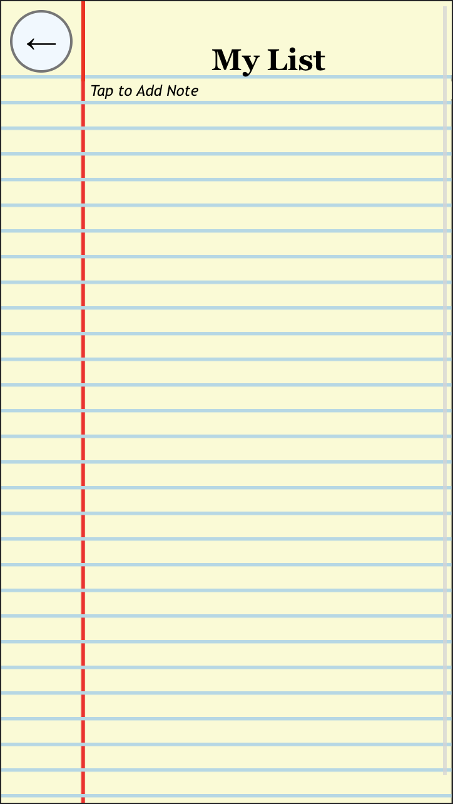

When you've entered a note, the next line opens up to be clicked and filled in. Each line comes paired with a check box 
and a select toggle on the far left side.

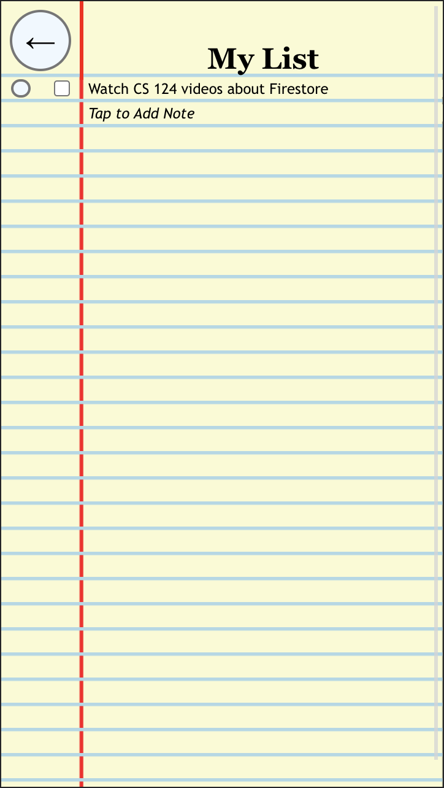

We can add a bunch of notes and they will all show up, each having their own checkbox and select toggle.

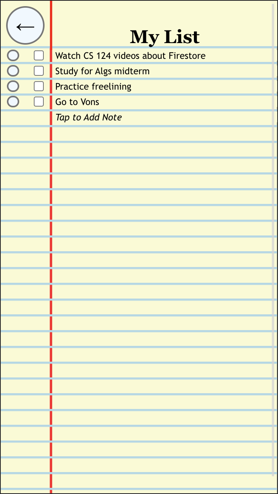

You can mark list items as 'completed' using the check box. When this happens, you are prompted with a button in the 
bottom right that acts as a toggle for showing/hiding your completed items in the list.
It also strikes through the checked item's text field.

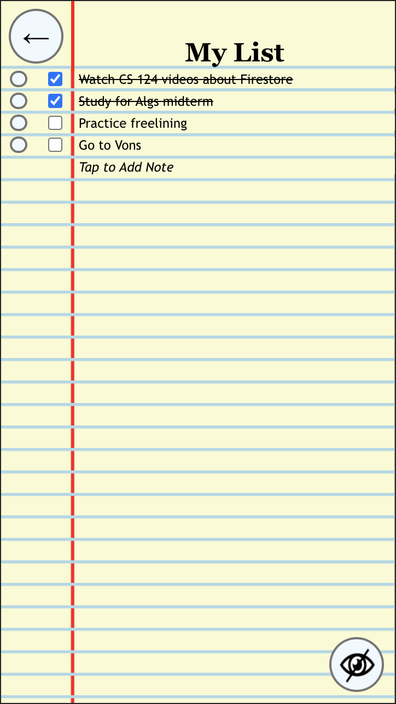

Hitting the toggle hides your completed list items, but the button remains in the bottom corner to allow you to show 
your completed items again. The picture will also flip between a show and hide state. The button only goes away once 
there are no completed items remaining (so they must either be unchecked or deleted).

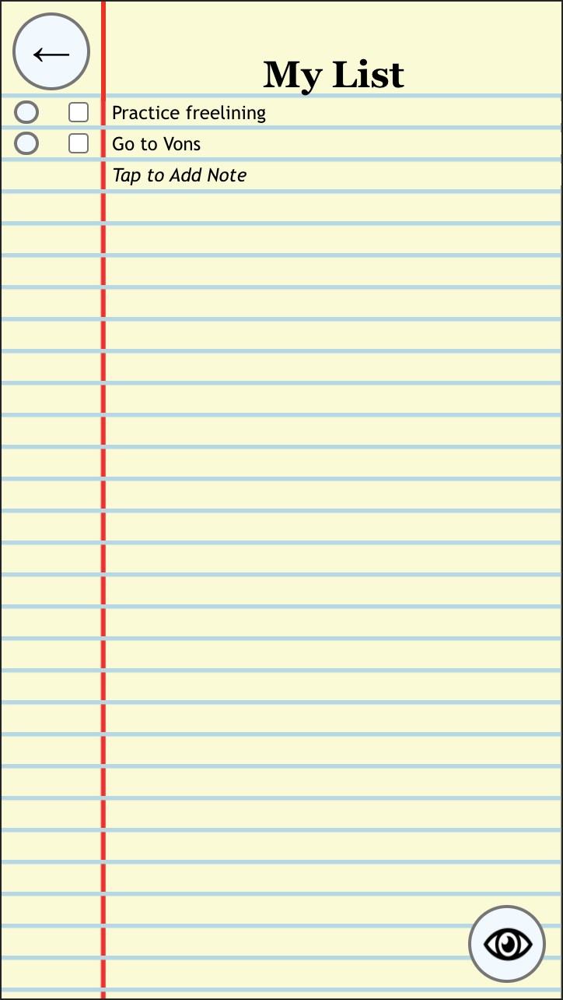

You are also able to select lines! We added this feature because we wanted the user to be able to delete groupings of 
all lines, whether they were completed or not. Selecting lines is done by clicking each line's select toggle on the far 
left of the screen. Once it is toggled, the entire line turns blue and a button pops up in the bottom left for deleting 
highlighted lines. For deleting individual lines you can also click on the line and remove all the text then backspace 
on an empty line.

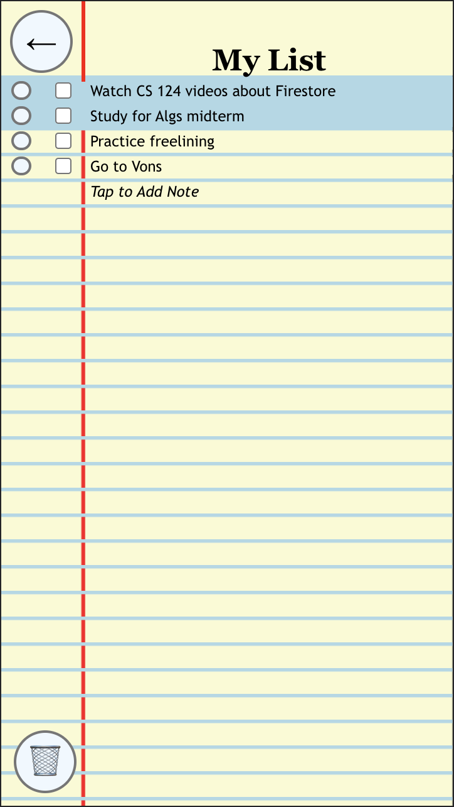

Pressing the delete button triggers a warning that you must accept in order to actually delete the items. We implemented 
this to prevent accidental deletions by the user.

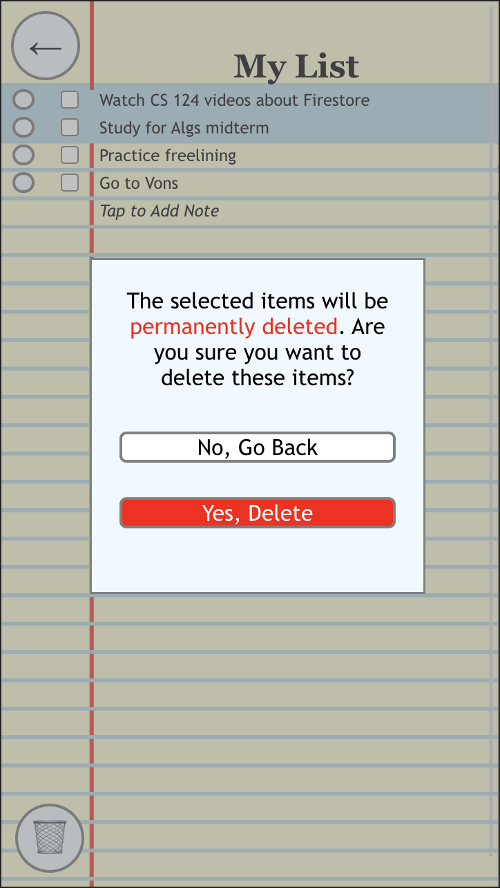

Once you've confirmed that you wish to delete, the deletion happens and the data is gone from the list.

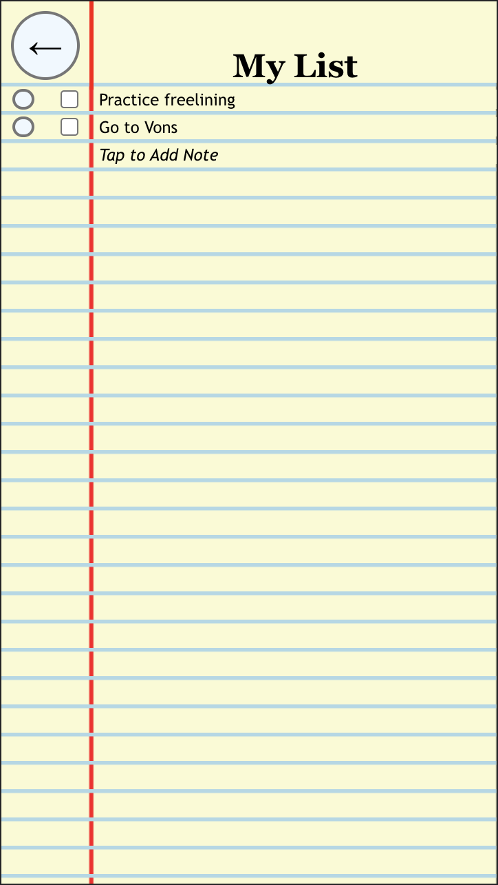

Completing and selecting lines are not mutually exclusive actions! You can do both things on the same line and our 
system handles things accordingly.

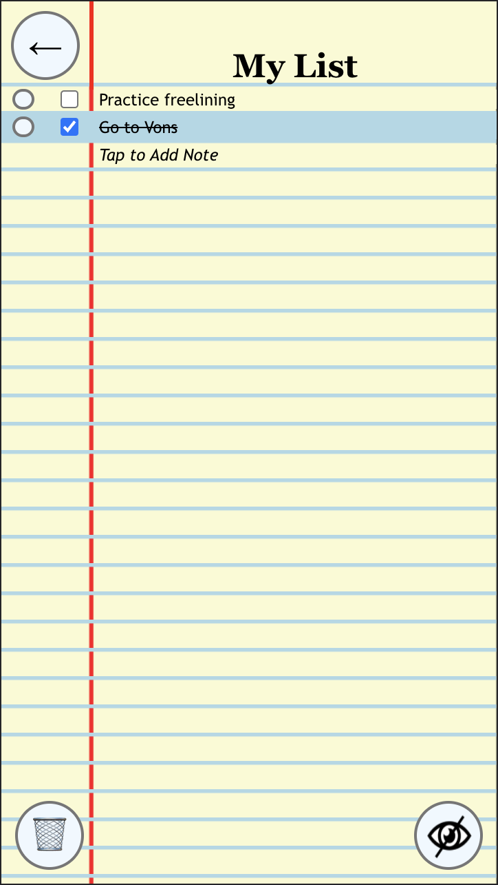

# Design Decisions

Most of our design remains unchanged from Lab 1. For a more general overview of our design decisions, please visit the separate Markdown page linked at the top of this one. This 
section will describe changes to our design that differ from what's stated in the Lab 1 Markdown.

Originally we wanted to use gestures to control things like selecting lines and deleting lines. However, we decided that 
such actions weren't very intuitive on a computer. We may return to this concept if we end up doing the extra-credit 
lab, however, as they would work well if we were actually designing this specifically for mobile. Because of this, we 
replaced sliding an individual line to delete it with removing all of the text within the line, where it will be deleted 
automatically. We also replaced a long press followed by subsequent clicks for selecting lines with a select toggle on 
the far left of each line. We think that this scheme is much clearer to the viewer in regard to what can and can't be 
done on a line.

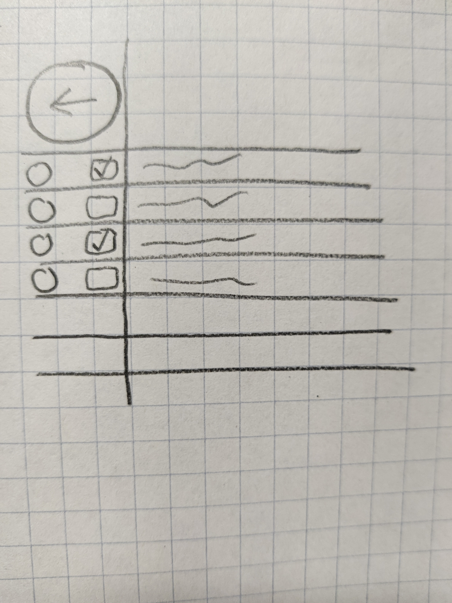

# Alternative Designs

We considered different shapes for the select button, including a square and a circle. In the end we settled on the 
circle in order to distinguish the select from the checkbox and unify it with the other buttons on the page.

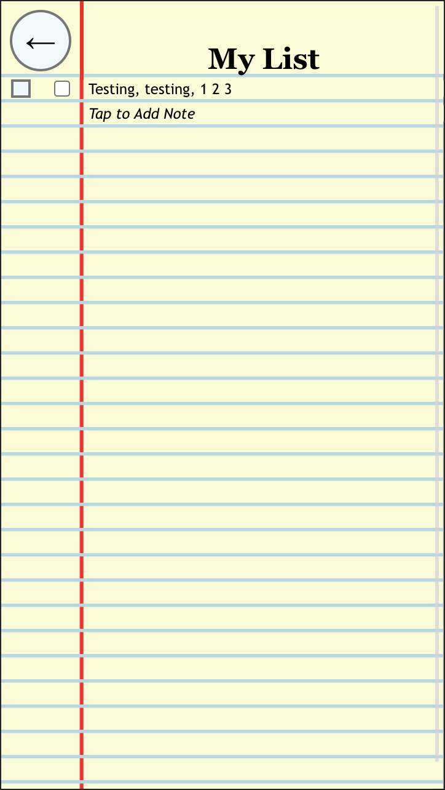

In our initial approach, we got the blue lines by styling each li that also contained the text data.
As we wanted the number of blue lines to fill up the page, however, this made actions like hiding list elements really 
difficult, as we would need to keep the data member but remove the text, keeping it somewhere else until the line was 
revealed again by the user. Because of this we essentially re-wrote everything to handle the lines differently. Our new 
(and final) approach uses images for the blue lines while only the data is contained within li's.

# User Testing
We wanted to do some user testing for this lab, but by the time we were ready we wouldn't have been able to meaningfully 
consider and implement any feedback on our design.

# Challenges

As previously mentioned, we had a lot of trouble with managing both the data lines and the visual blue lines at once. We 
also had difficulties getting the window to scroll properly once new lines are added and everything can no longer all 
fit in the container.

# What We're Most Proud Of

We're proud of how we got everything to flow together in our final design! We're also proud that we stuck to the visual 
aesthetic from our Lab 1 proposal, as hard as it was to implement at times.