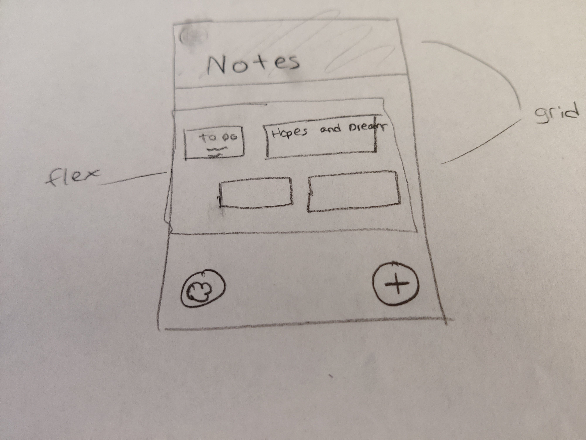
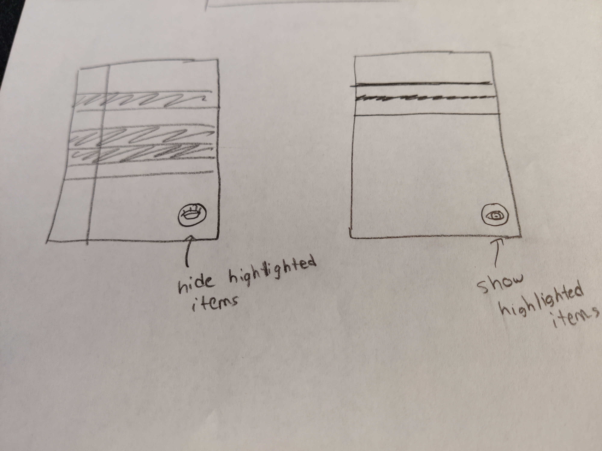
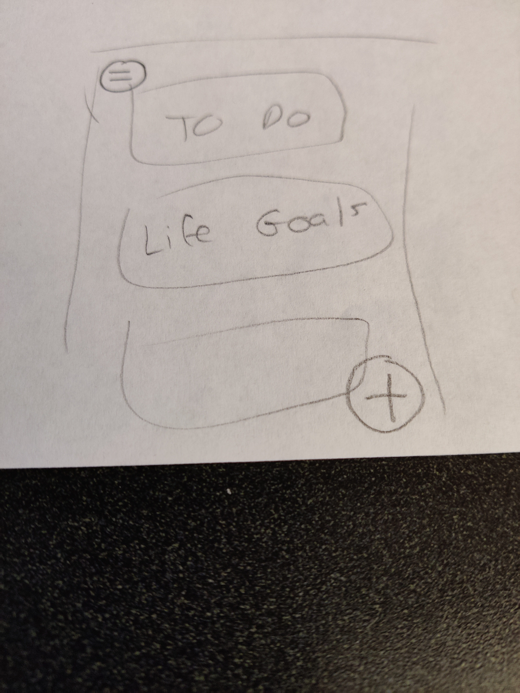

# Design Decisions

Our first major decision was how we should organize our list, both structurally and visually. Should there be lines 
separating elements, or should they be free-floating? Where should the checkboxes go? We wanted a design that would be 
performant enough for power users while accessible to those less comfortable with technology. We thought a lot about 
this, and in the end we decided to model our design around a classic piece of lined paper. This gives it a tangible 
connection to a real life object that everyone has used before, making certain questions self-explanatory. However, 
we've also baked in more intricate ways of interacting with the list, such as long presses and gestures. 

We then decided to use flex boxes for our homepage, allowing us to represent each note in a box and thus allowing us to 
better format our homepage as we could change the positions of each individual box.

One other important design consideration involved hiding and deleting list elements. We thought of different ways in 
which we could show only uncompleted items and we decided to allow users to hide items by highlighting them and 
clicking an eye button.

# Alternative Designs

One of our considerations for the home screen involved a single column of list titles in which you'd scroll through. 
However, this led to a situation where there would be too much free space on the sides of the screen. It also was hard 
to decide on what size the boxes should be. 

We also considered binding some additional tasks - especially hiding and deleting completed items - as buttons on the 
bottom of the screen. However, this comes at the cost of obscuring content within the list, and such drawbacks are 
compounded when these elements are static fixtures on the page. This is why we went with the touch-and-hold highlight 
system, as it allows specialized buttons for hiding and showing items to pop up only when they're truly needed.

When considering how to show only uncompleted items, we considered having a line at the end of the list which would 
allow users to both understand that there were hidden items and how they could reveal these items. However, we realized 
that this would prevent the ability of users to tap anywhere below our "Tap to Add Notes" line at the end of the list. 
Also, we did not want to have two lines at the end of our list each giving different instructions as it would make the 
design more cluttered. 

# User Testing

We did not do any user testing on our pages for this lab. Once it is operational for Lab 2, we will 
definitely do some user testing with friends a-la Steve Krug's *Don't Make Me Think*.

# Challenges

We encountered many issues when trying to properly format our grid boxes and flex boxes. Also, there were many times when
we had a great deal of trouble trying to align things by using padding and margins.

# Parts of the Design We're Proud Of

Neither of us were very familiar with frontend development before taking this class, so our HTML/CSS skills improved a
lot over the course of this lab. We've grown to understand things like flex box and grid box very well, and learned lots 
of little tricks, like how to flip images using CSS. We're proud of the overall layout of both the notes and the home screen, as we put a lot of work into lining things up and making information flow elegantly and efficiently. We're also proud of the gesture controls we've planned around for certain tasks.