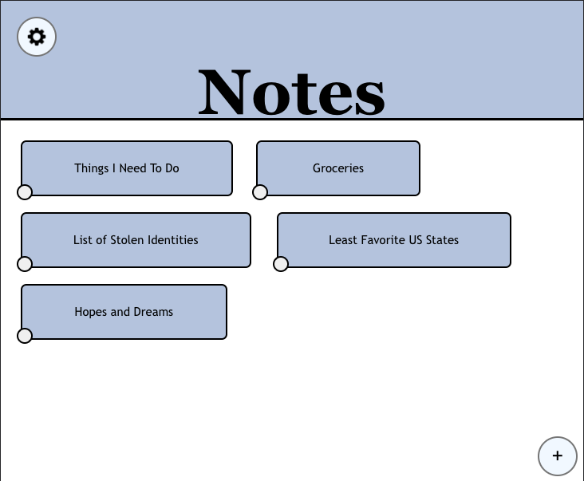
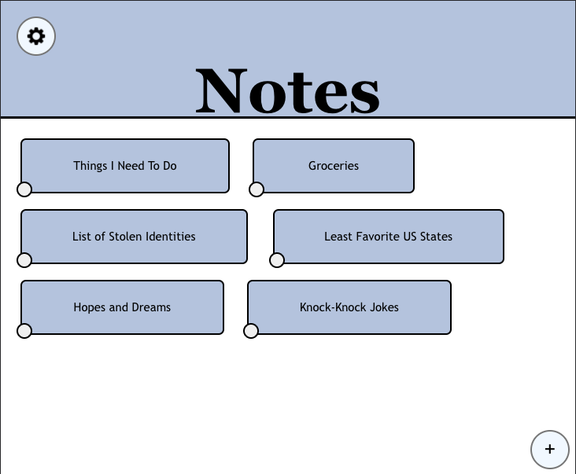
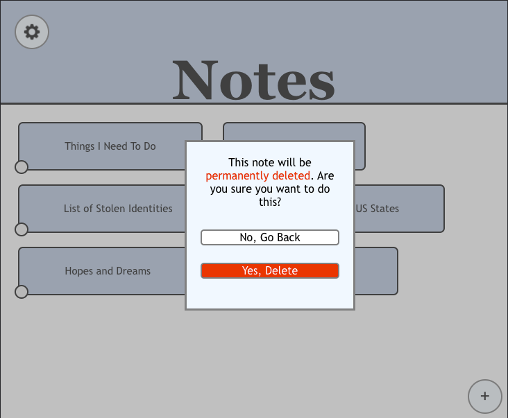
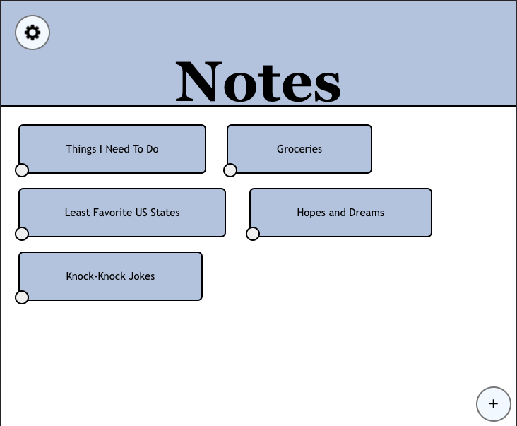
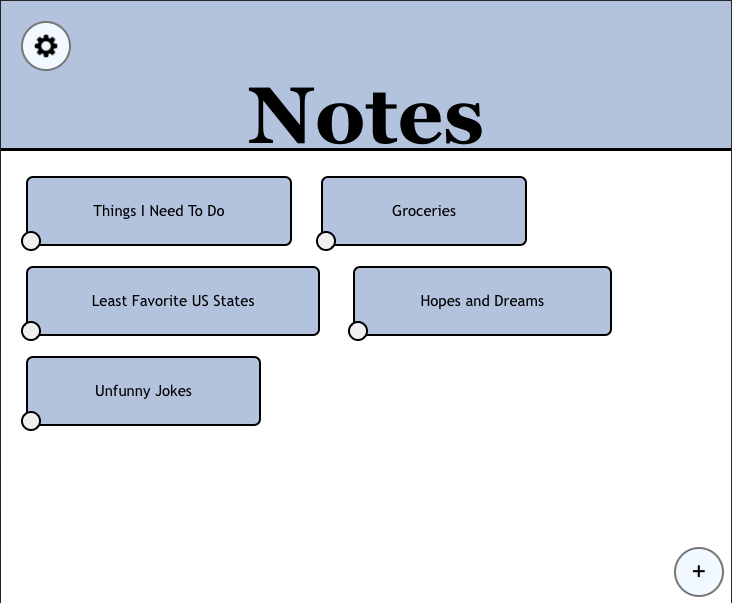

### [Link to Design Document for Lab 1](designlab1.md)

### [Link to Design Document for Lab 2](designlab2.md)

### [Link to Design Document for Lab 3](designlab3.md)

# New Changes to our Design

Because we've added responsive design in this lab, all of these example screen grabs will be in of a different screen size than before.

We'll start on our list screen. There aren't many changes to be found here, except that we changed the size of each note line to make them easier to read. 
What's exciting, however, is that our back button in the top left finally takes you somewhere!

Clicking the back button in any list takes you to the home screen. Here you can access all of your current notes, create new ones, 
and perform operations on them (such as deleting and renaming). Our styling on this home screen was inspired by the design we built all the way back in Lab 1.
The settings button in the top left doesn't do anything yet, but when we add authentication and note sharing in Lab 5 we'll probably place some settings behind it.

You can add a new note by clicking the '+' button in the bottom right of the screen. This brings up a popup that lets you enter your desired title for the note. Hitting Enter on your keyboard confirms the note and adds it to the list.

As you can see, we've added a new note titled 'Knock-Knock Jokes'. With this note created, you can click on it and it will automatically take you to a list that is ready for you to add content to. Everything is ready to go for the user!

Each note comes with an options button in its bottom left corner. Pressing it brings up all the operations you can do on that note. Right now we only support deleting and renaming, but Lab 5 will bring about a 'Share' option as well.

When these options are toggled and the note is on the top or in the middle of the list, it pushes the list down rather than displaying the options over other notes.

Perhaps you want to delete a note, such as our 'List of Stolen Identities' (it's incriminating evidence, after all). To do that, you press the 'Delete' option and it brings up a popup asking you to confirm your choice.

Once you delete a note, that note along with its list data is gone forever, so make sure you're 100% sure you want to delete it!

We just read over our list of knock-knock jokes and they're all pretty rough. So let's give this note a new name that better reflects what we've put inside of it!
To do this, you press the note options button again and choose the 'Rename' option that pops up. This brings up yet another popup 
that asks for the note's new name. Typing in a new name and hitting Enter completes the renaming process.

With the rename done, the list and all of the data within it stays, but it has been given a more appropriate name.

# Link To Accessibility Videos

Finally, check out our videos showcasing keyboard controls and screen-reader compatibility here:

https://drive.google.com/drive/folders/1aIgwLQDjErsbSfict-rjo8wyWqu0rPyo

# Design Decisions

Once again, we revised how we handled each line in our lists (making them yellow with blue borders). In Lab 1, we did this by styling each li with the proper colors and spacings. When we had to make our design functional in Lab 2,
storing data locally made it too hard to bind the line graphics to each element in the list, as we would have to change the data while preserving all the slots in the list.
As such, we made the line graphics an image and laid the list data on top of them. With Lab 4, handling each line's text and graphics separately was too difficult to handle responsively, so we returned to styling each li. It took a lot of CSS work, but we pulled it off!

# Alternative Designs

On our home screen we considered having each note be a fixed size. To make more use of the screen space, however, we decided instead to have the boxes expand to fill a third of the horizontal space at max. This 
means that we can have a maximum of three notes on each line on our home screen.

# User Testing

We did not do any user testing.

# Challenges

We struggled a lot with styling our notes app. We definitely paid a price for all our previous decisions that weren't the cleanest but 'just worked'. Sorting this out was especially important for our responsive design, but 
it played a factor in our accessibility work as well. Revising our 'Tap to Add Note' line was difficult as well. Previously that line was actually a data element that would live in the data list, be dealt with in Firestore, etc. but Prof. Rhodes suggested that we handle it locally instead. It was a bit of a pain to wrangle (in both functionality and styling) but we got it done.

# What We're Most Proud Of

We're proud that we went through CSS hell and made it out alive. We also really liked returning to our home screen design from Lab 1 and making it functional!
