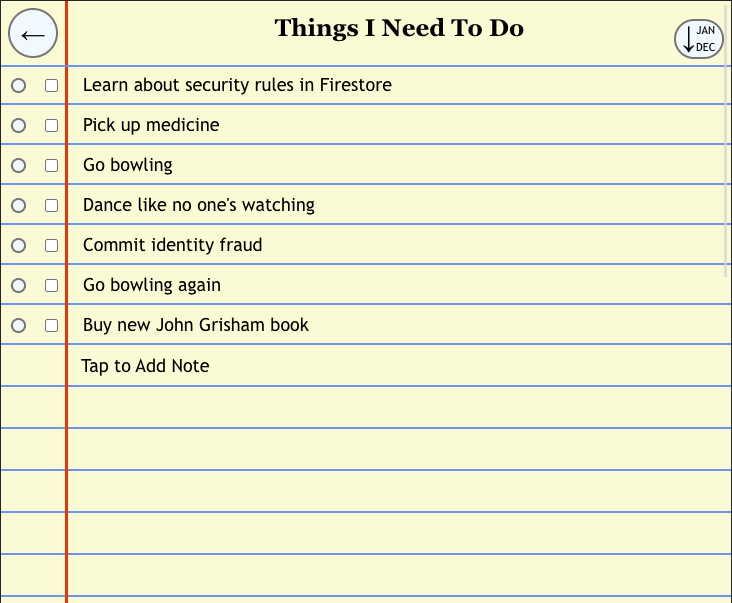
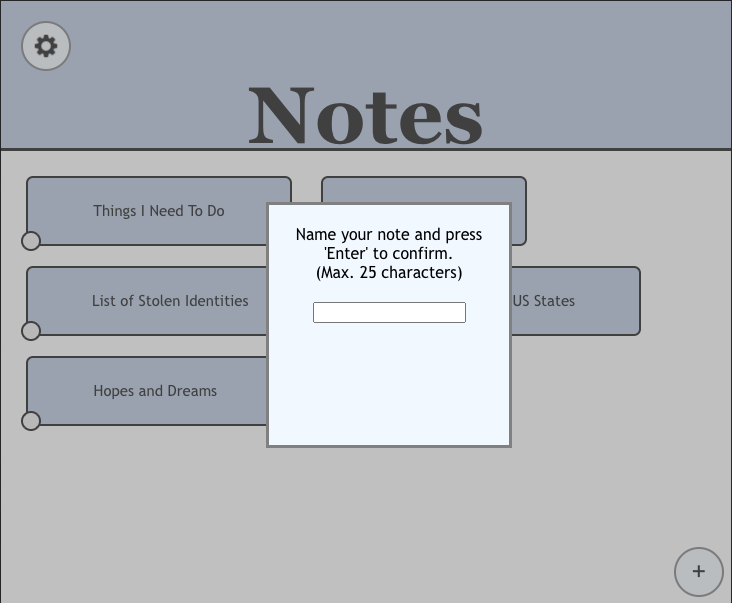
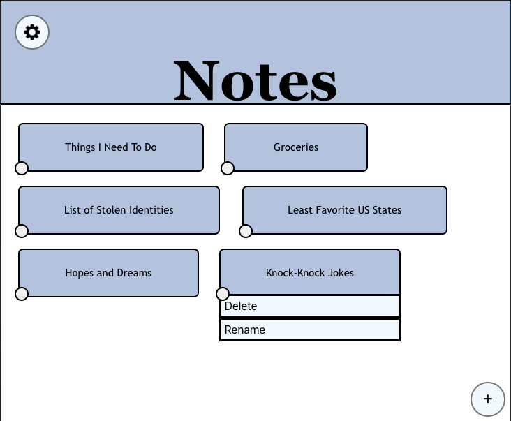
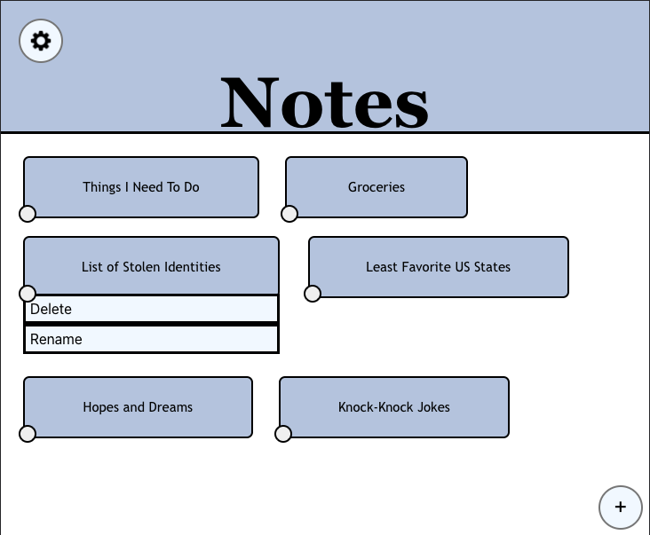
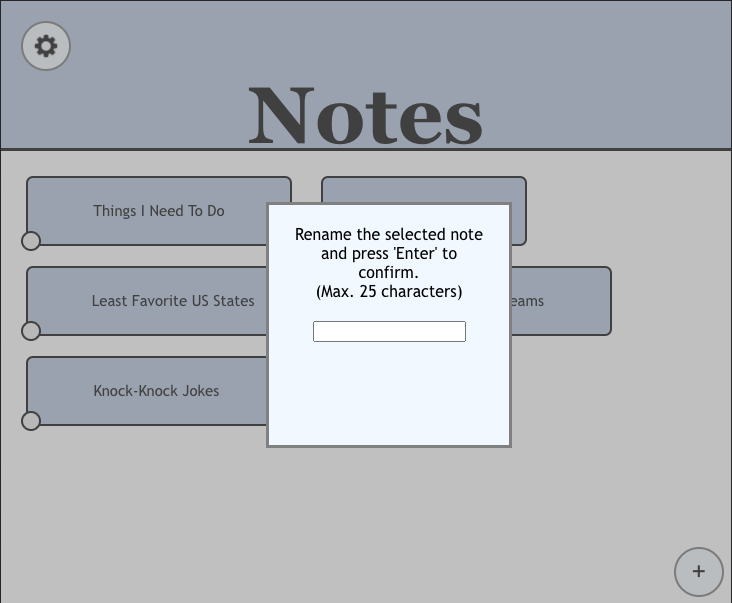

### [Link to Design Document for Lab 1](designlab1.md)

### [Link to Design Document for Lab 2](designlab2.md)

### [Link to Design Document for Lab 3](designlab3.md)

### [Link to Design Document for Lab 4](designlab4.md)

# New Changes to our Design

Let's start on our new login screen!

This is where a new user starts off with our application. You get an example screenshot for what our notes app looks 
like once you're signed in, and a choice between signing in and signing up.

New users should click the 'Sign Up' button, where they will be able to enter an email and password to register an 
account. Our application senses when a provided email is invalid, and will kick that error back to the user.

When you press the 'Sign In' button, the user is able to log into the app using their email/password credentials. Our 
app will show errors if the user has inputted an invalid email or an incorrect password. You can also use Google sign-in 
if you prefer.

Now that we've logged in, the app showcases the current user as well as a 'Log out' option in the top right of the 
screen.

There are now new options on each note! To access them, tap the circle button in the bottom left of each note. If you 
are the original creator of a note, you'll be able to hit the 'Share' button to adjust permissions for other users to 
access it.  

Hitting this button as an owner allows you to input the emails of users you want to share with, as well as their desired 
permission level (editor or viewer). Editors are given full permissions for the note, except that they cannot share it 
with other people. In contrast, viewers can only access what's inside the note and sort it (no adding/hiding of data or 
adjusting priority levels) and are not able to rename or delete a note either.

If you are a shared editor or viewer for a note, you will not be able to adjust sharing permissions but can still see 
who else is shared on the note through the 'Shared with' option.

Hitting 'Shared with' produces a static list of the current permissions for that note.

One final thing to note is that notes you can view are colored differently compared to those you own and have editing 
privileges on. We wanted to give a subtle distinction between these types at the top-level, as they differ pretty 
substantially with what you can do.

# Design Decisions

We decided to let both the owner and shared editors of a document delete the list. This is because
editors have full permissions to change what's inside the list, and deleting all the lines of data inside the note
is functionally equivalent to deleting the note itself, so might as well give them that permission. If we had some sort
of revision history where the owner could revert to an older version of the note to correct malicious edits, then we 
would only let the owner delete the note outright.

# Alternative Designs

We originally had the sign in and sign up pages on top of each other on our log in page. But we thought that this was 
confusing for transitioning between signing up and signing up, so we implemented the current method where the main Sign 
In and Sign Up buttons stay fixed while the content shifts below. 

# User Testing

We did not do any user testing.

# Challenges

We had a lot of trouble with the security rules until we realized that our queries needed to change to reflect those 
rules.

# What We're Most Proud Of

We're proud of getting some more complex features in with our sharing method, such as bad username/password error 
checks.