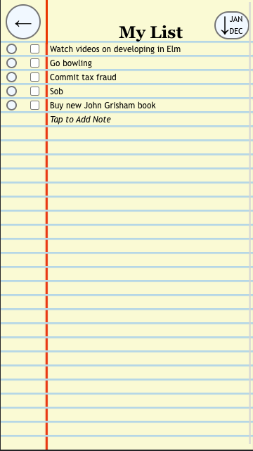
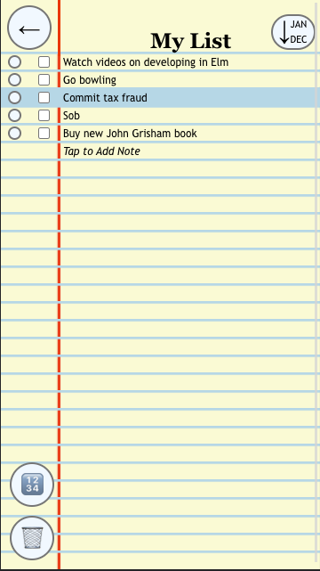
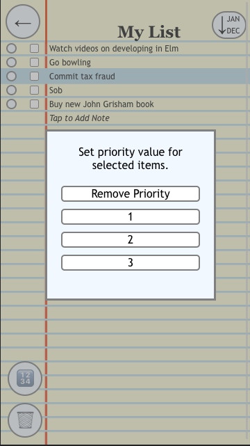
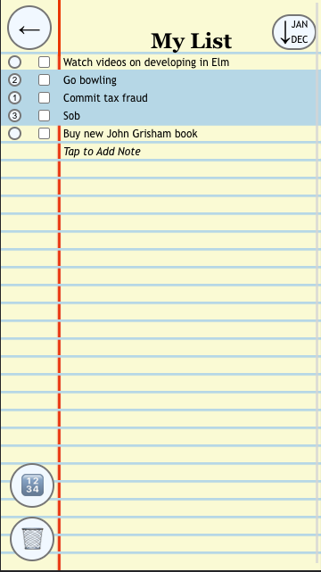
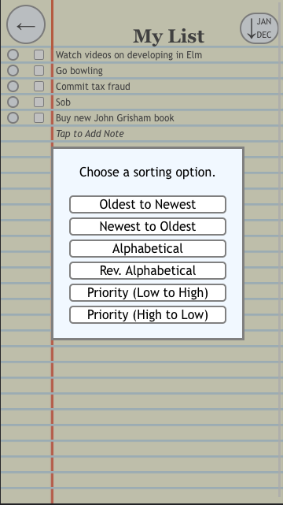
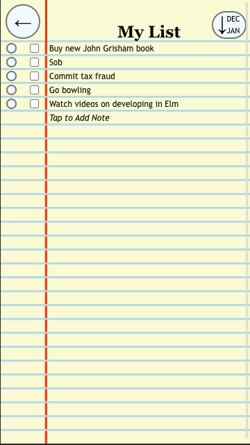
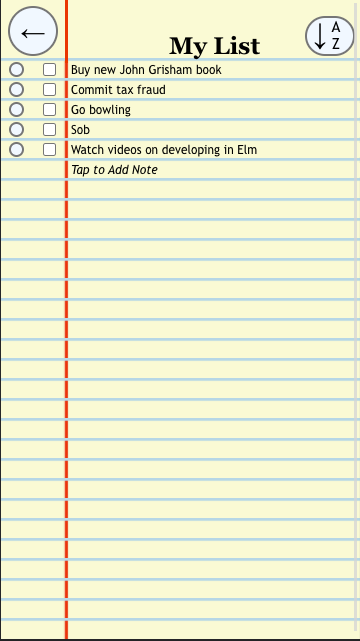

### [Link to Design Document for Lab 1](designlab1.md)

### [Link to Design Document for Lab 2](designlab2.md)

# New Changes to our Design

When you add two or more items to the list, you'll notice a new button in the top right corner of the screen. This is 
the sort button! We'll talk about its functionality later.

Selecting a line using the selection buttons on the far left reveals another new option: setting priority! It is done 
using the circular button with numbers on it right above the trash can.

Hitting the priority button brings up a menu that lets you choose the priority level for all selected items. You can 
choose a number between 1 and 3, or decide to remove all existing priorities on your selected lines.

With the priority button, you are able to assign priority levels to individual lines by selecting them one at a time. You can also give the same priority to multiple lines by selecting them all and setting priority en masse. This is very useful for sorting 
the data in the list! Speaking of which...

Hitting the sort button brings up a menu which gives you six different choices for sorting the list. We will go through 
each one now.

Sorting from oldest to newest is our default way of arranging the list data, hence why the ordering of the data as well as the image in the sort button has
not changed.

On the other hand, sorting from newest to oldest places new list elements at the top of the screen. The 'Tap to Add 
Note' line stays at the bottom, however. Note how the image in the sort button has changed due to the new sort type!

This is what sorting the list alphabetically looks like (technically we're sorting the list lexicographically, but we 
figured that would be too confusing to put in the menu for average users).

We can also sort the list in reverse alphabetical order!

With priority sorting, now our priority values come into play. When sorting from low to high, the unprioritized elements 
come first, then the prioritized elements in ascending order, and lastly the 'Tap to Add Note' line stays on the bottom.

Priority sorting from high to low sorts our list elements the opposite way.

# Design Decisions

Placing the priority values within the select buttons was an obvious choice for us, as the insides of the buttons were 
unused space on the screen that was pretty valuable, as it sits close to the actual lines of text. We only have it 
show up when one or more lines are selected because we wanted to reduce visual clutter in our design.

Another important decision we made was having the sort button display the current sorting method being used. We 
considered (but did not implement to test) placing a colored box around the current sort type in the sort menu, but by 
indicating sort method in the button itself, it saves the user from clicking into the menu to check.

# Alternative Designs

We considered having the sort button be in the top right at all times, but we decided that sorting the list (and by 
consequence the sort button) would serve no purpose when 0 or 1 elements were in the list, so we decided to have it show 
only when 2 or more elements are present. We were concerned that this showing up all of a sudden would be jarring, but 
in motion our design works fine.

# User Testing

None for this lab! But we really should for Lab 4, as we're going to be making some pretty big changes (support for 
multiple lists, keyboard navigation, screen readers, etc.).

# Challenges

We struggled with a lot of the Firestore stuff, especially implementing queries and indexes. When we initialize our list 
with 0 items, we automatically add a document to Firestore via setDoc.  However, this adds two documents to the 
database, which we were unable to trace, so we determined that this was likely due to the amount of time it takes to 
render the database. Therefore, we have to manually delete one of these documents by going into the Firestore database. 
This is not an issue that can be detected in the current state of our design however when we want to initialize a new 
list in future labs, this will be an issue as we cannot manually edit the Firestore database each time we create a new 
list.

# What We're Most Proud Of

We're proud of how we've kept our visual design unified, even with our list app having so many functions now!
